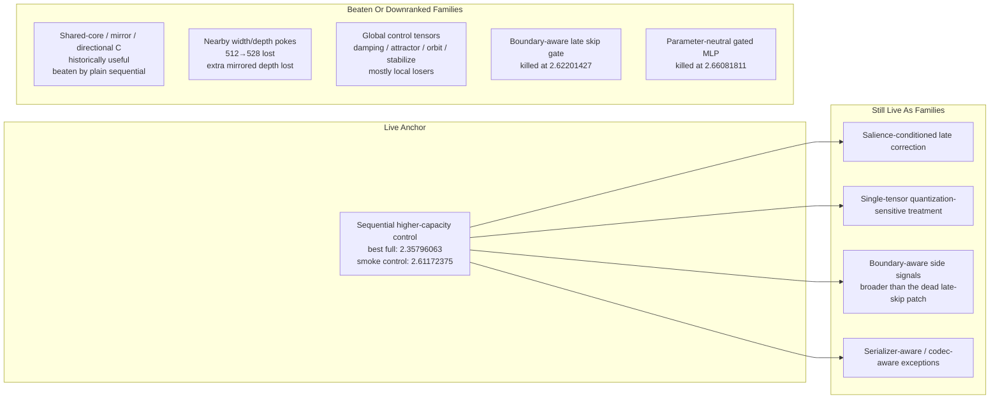
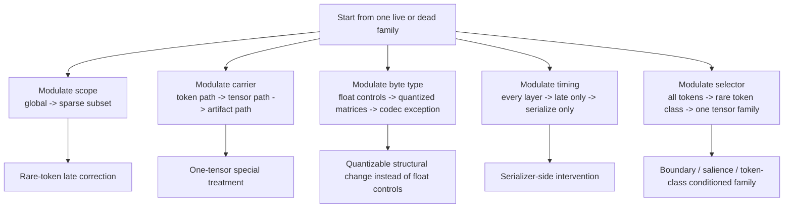
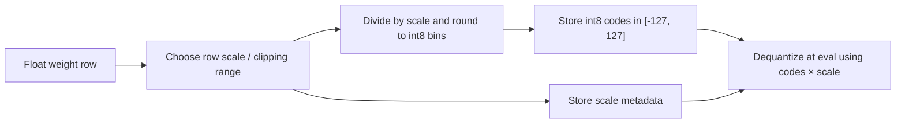
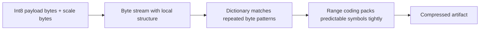
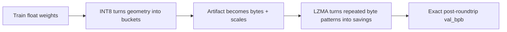

# Parameter Golf Monkey Brain Worksheet

Use this when you have a strong gut feeling but not yet a clean hypothesis.

The purpose is to turn monkey-brain pattern notices into:

- one new mechanism family
- one exact locus
- one byte story
- one smoke kill criterion

## Current Ground Truth

Best full local result:

- `mlx_full_seq_mlp4x_200_realval_vb524k`
- exact `val_bpb = 2.35796063`

Smoke control:

- `mlx_seq_mlp4x_lzma_cmp_v2`
- exact `val_bpb = 2.61172375`

Recent killed families:

- boundary-aware late skip gate
  - exact smoke `2.62201427`
- parameter-neutral `relu²`-gated GLU
  - exact smoke `2.66081811`

Current read:

- plain sequential higher-capacity is still the live control family
- nearby width/depth tweaks are downranked
- global corrective controls are downranked
- new family bets should now be more selective, more byte-aware, or both

## What "Monkey Brain" Means Here

It does **not** mean random guessing.

It means:

- you notice a structural asymmetry before you can fully explain it
- the asymmetry points to a different **place**, not just a stronger knob
- you cash it out into a small, falsifiable patch

Good monkey-brain input sounds like:

- "this feels too global"
- "this probably only matters for a weird subset"
- "one tensor is carrying too much semantic load"
- "the model might be fine in float-space, but the artifact path is killing it"
- "this mechanism is probably firing in the wrong place or on too many things"

Bad monkey-brain input sounds like:

- "maybe width 528 again but cleaner"
- "maybe the same gate but stronger"
- "maybe the same family with three more knobs"

## Fast Capture Prompts

Fill these quickly. Do not justify yet.

1. What feels too global?
2. What feels too uniform?
3. What feels too expensive in float form?
4. What seems like it should only matter for `1-5%` of cases?
5. What seems unusually important after compression?
6. If one tensor got special treatment, which one would you choose?
7. If one mechanism became rarer, where should it fire?
8. If one part of the system is "too generic," where is it?

## Gut-To-Family Translation

| Monkey-brain signal | Likely new family |
|---|---|
| "only rare positions matter" | token-class-selective family |
| "one tensor is sacred" | quantization-sensitive tensor family |
| "late correction feels blunt" | sparse late correction family |
| "float controls cost too much" | quantizable structural family |
| "compression is where score dies" | serializer-aware / codec-aware family |
| "this should depend on token type, not layer count" | token-conditioned family |
| "this should depend on tensor role, not token content" | tensor-role family |

## Current Family Map



## Modulation Levers

This is how you turn one family into a different family entirely without just retuning the same idea.



## Family Mutation Table

Use this when you want to move into a new family without losing contact with current evidence.

| Start family | Change one axis only | New family shape |
|---|---|---|
| shared-core correction | global -> rare subset | rare-token revisit correction |
| boundary-aware gating | token path -> tensor path | special treatment for one late tensor path |
| global control tensors | float controls -> quantized matrices | structural operator change that survives int8 |
| sequential capacity | everywhere -> late only | late sparse correction family |
| architecture change | forward path -> artifact path | per-tensor codec / clipping / quantization family |

## Monkey Brain Worksheet

### 1. Raw Notice

Write the dumb gut sentence exactly:

- "it feels like..."

Do not make it respectable yet.

### 2. Exact Asymmetry

What asymmetry are you actually claiming?

- token subset?
- layer subset?
- tensor family?
- artifact stage?

Pick one.

### 3. Byte Story

Why could this survive exact re-encoding?

Complete this sentence:

- "this could help after int8 + lzma because ..."

If you cannot complete that sentence honestly, stop.

### 4. New Family Name

Name the family in plain words:

- rare-token late correction
- one-tensor quantization exception
- boundary side-channel
- serializer-aware tensor exception

Do not name the patch yet. Name the family.

### 5. Exact Locus

One file, one function, one path:

- file:
- function:
- exact site:

### 6. Minimal Patch

What is the smallest patch that tests the family?

- one mechanism:
- one locus:
- one smoke:
- one kill criterion:

### 7. What Must Stay Unchanged

Freeze the control:

- width:
- depth:
- tokenizer:
- quantization path:
- compressor:
- smoke protocol:

### 8. Kill Criterion

Use an exact number:

- smoke baseline to beat: `2.61172375`
- kill if:

### 9. If Dead, How Does It Mutate?

Do not tweak inside the same family immediately.

Write:

- if this loses, I mutate along this axis:
- into this new family:

## INT8: What It Actually Does

Mental model:

- float geometry becomes buckets
- every row gets a scale
- values are clipped / rounded onto an integer grid
- the saved artifact is now "integer codes + scales", not the original float surface



Tiny picture:

```text
float row:   -0.91  -0.02   0.00   0.03   0.87
scale:       row_max / 127
int8 codes:   -127    -3      0      4    121
```

Why this matters:

- if a few outliers dominate a row, the whole grid gets coarse
- if many values collapse into the same small buckets, int8 can be efficient
- tiny float control tensors are dangerous because they may skip the cheap big-matrix pattern entirely

## LZMA: What It Actually Does

Mental model:

- it does **not** understand tensors
- it sees a byte stream
- it rewards repeated local patterns and punishes high-entropy novelty



Tiny picture:

```text
Good for LZMA:
00 00 00 01 00 00 00 01 00 00 00 01 ...

Bad for LZMA:
7A C1 13 94 5F 02 E8 71 4C B9 0D A7 ...
```

Why this matters:

- repeated zeros help
- repeated low-magnitude patterns help
- correlated neighboring rows help
- many one-off float bytes hurt
- fancy mechanisms that create brittle, unique byte patterns often lose even if they look elegant in float-space

## Combined Mental Model

This is the core artifact truth:



Short version:

- `INT8` asks: can this be represented with a simple bucket grid?
- `LZMA` asks: do those bucketed bytes repeat?
- good Parameter Golf mechanisms survive **both**

## Candidate Monkey-Brain Directions Still Worth Having

These are not run recommendations. They are family prompts.

| If your gut says... | That points toward... |
|---|---|
| "only rare positions deserve special handling" | token-class-selective correction |
| "one tensor matters much more than others" | single-tensor quantization exception |
| "late layers should not treat all positions equally" | salience-conditioned late correction |
| "float controls are wasting bytes" | quantizable structural family |
| "compression is the real enemy now" | serializer-aware family |

## Final Rule

Do not ask monkey brain for a patch.

Ask it for:

- the asymmetry
- the locus
- the byte complaint

Then build the patch yourself from those three things.
